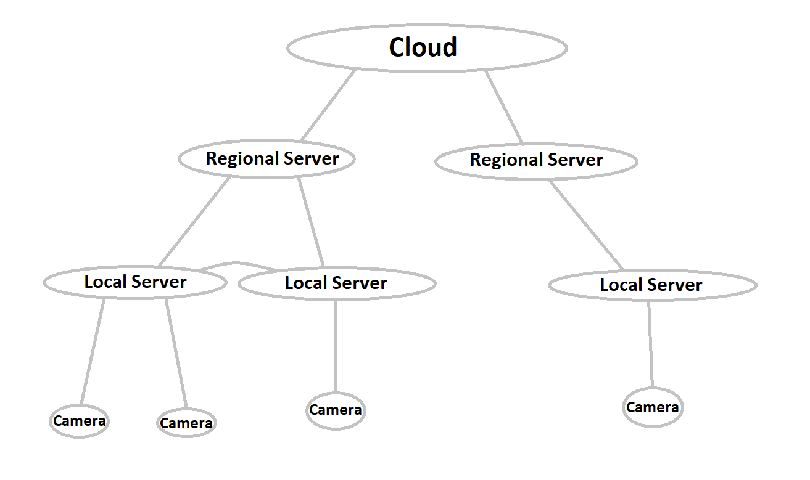
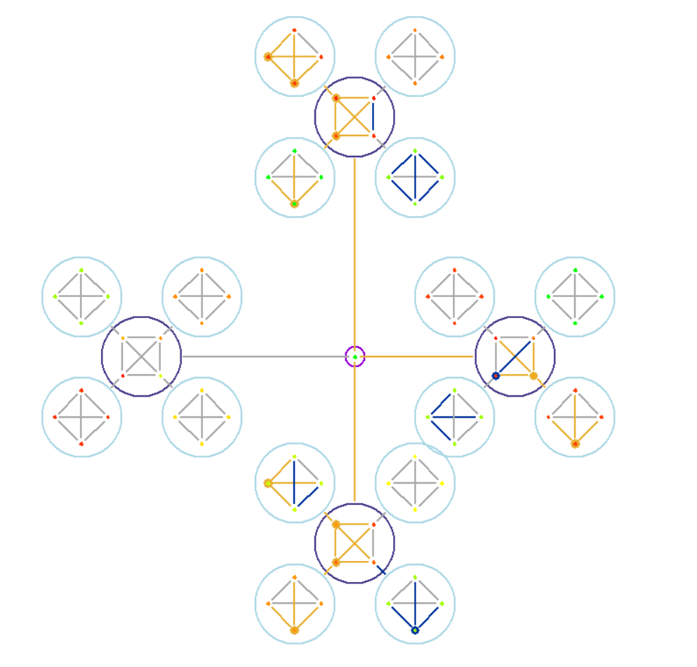

# IoT project nr 7

This project was created for 'Internet of Things' course in AGH University.
It's meant to design and test algorithm for arrangement of computational processes in IoT network.
Simulated scenario is network of city's cameras and analysis of video material they provide.

## Creators:

Paweł Marszał

Jakub Nowobilski

Patryk Skupień

Jakub Wydra

## General information

### Devices - agents

Network is built from connected devices.
Each of them has some computing power (measured in Units / unit of time), can communicate with other devices and perform computations.

Devices are grouped into 4 categories:

0) cloud            - single, very powerful server that can perform basically any computation in no time

1) regional server  - groups some number of local servers, with more computational power than each of them

2) local server     - smallest server in our network, it receives tasks (video material) from cameras

3) camera           - has no computational power, it's function is to provide servers with tasks to perform

General structure of network looks as follows (from top to bottom):

Every camera has exactly one server as it's parent.

### Tasks

Tasks to compute are main subject in this project.
Cameras generate them randomly based on configuration, and send them to their servers.
Every task has specified number of computing units necessary to complete it, and maximum time it needs to be completed in.

Important assumption in our simulation is that every task can be divide in any manner, and that sending them between different devices takes no time.

### Algorithm

We decided that main rule of our algorithm will be maximization of usage of local servers.

Our algorithm is as follows:

- when device receives task to compute, it checks if it can compute all of it in required time.

    - if it can, task is subscribed on TODO list, assigned some part of device's computational power and is being computed in some time

        - after completion result is generated

    - if it cannot, device ask its neighbours if they can do it. then task is divided between itself and said neighbours.

        - if there is still some part of the task left, that cannot be computed by any of device's neighbours, it's send up to device's parent

        - after division of a task, device waits for all partial results and then combines them into one result

- after result is ready (either generated or combined from parts) it is send back to its source device

## Visualization

### Technology

For visualization tkinter package is used. It was chosen for easy and simple API and because it comes with most Linux platforms as well as Windows.
Window and canvas setup and initialization are done in Drafter class constructor in node_draw.py file. Moreover node_draw.py includes API for drawing.

node_draw.py API:

- draw_configuration() - draws entire configuration
    - allows to draw configuration without cloud with only components of cities and / or districts
    - allows to draw configuration of entire cloud alongside with components not connected to cloud
- draw_cloud() - draws entire configuration of cloud with children components
    - allows to draw configuration with components of districts directly connected to the cloud
    - aligns its children component in a circular way leaving for cities components more space and adding space after each city component
- draw_cities_components() - draws configuration of all cities components
    - its used outside draw_cloud() function for drawing cities components not connected to cloud
    - aligns components in a circular way
- draw_districts_components() - draws configuration of all districts components
    - its used outside draw_cloud() function for drawing districts components not connected to cloud
    - aligns components in a circular way
- draw_cities_component() - draws entire configuration of component of cities connected with each other
    - it draws all components of districts connecting each component with corresponding city node
    - it allows to draw configuration with multiple components of districts connected to one city node
    - additional parameter was introduced to avoid overlapping lines by rotating entire component with children components
- draw_component() - draws entire configuration of component of nodes connected with each other
    - node can be a city node or a district node
    - nodes are being aligned in a circular way allowing to draw any number of nodes and connections without overlapping lines
- remaining functions can be grouped in 3 categories:
    - low-level canvas drawing - drawing circles, wheels, lines and connections
    - high-level canvas objects parameter changing functions - changing colors accordingly to nodes state
    - auxiliary functions

### Interpretation

Big circles contains connected neighbours of the same class. Inner, little circle contains the cloud.

Black circles contain regional servers and gray circles contain local servers.
Cameras are not presented on the graph.

Single points represent devices. Color of the point tells about percentage of CPU currently in usage. 
Green means very low usage, and red - very high.

Lines represent connections between devices, specifically neighbours. 
Their color tells if task is being sent (yellow), 
result is being received (blue) or there is no communication at the time (gray).

Circles around devices serve the same purpose as lines (and are being coloured in the same way), 
with one difference - they tell about communication with device's parent. 

### Examples

## Some statistics

We decided that good measure of effectiveness of our algorithm will be average usage of computational power of devices in the network.

TO DO: write something more about it and insert plots

